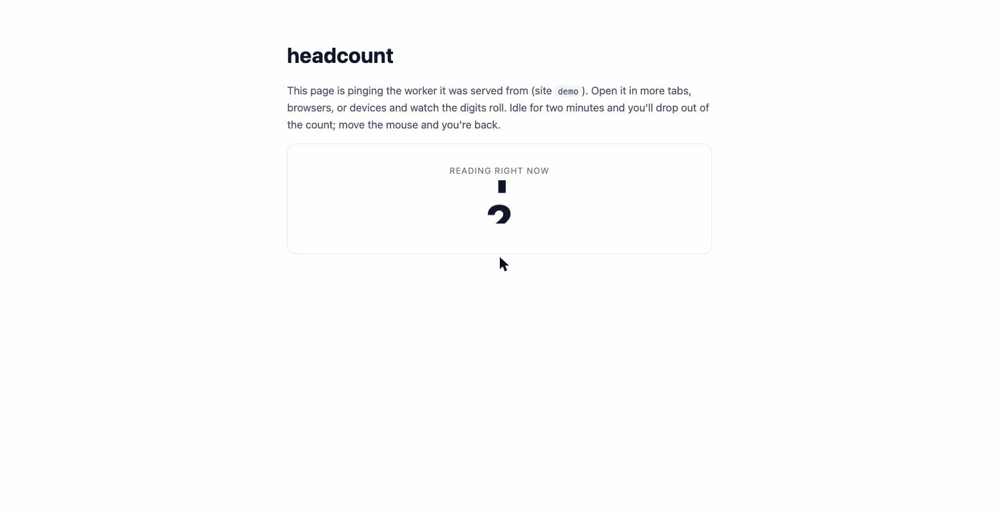

# headcount

Real-time concurrent-visitor counting for any website — running entirely on
Cloudflare Workers + Durable Objects. No backend. No database server. No
analytics suite. Deploy a worker, add a script tag, get a live count.



**[Live demo →](https://headcount.flat-thunder-531a.workers.dev/demo)** — open
it in a few tabs and browsers; counts push over WebSocket the instant they change.

```
┌─ browser tabs ─────────┐      ┌─ Cloudflare edge ──────────────┐
│ headcount.js           │      │ Worker (/ping /ping.gif /live) │
│  · one id per browser  │ ping │   └─▶ Presence DO (per site)   │
│  · one leader tab pings├─────▶│        · SQLite visitor table  │
│  · idle/hidden pause   │      │        · alarm expiry          │
│                        │      │        · optional webhook ─────┼──▶ your DB
│ <headcount-badge>      │◀─────┤ GET /live  {count, paths}      │   (optional)
│  odometer digits roll  │ poll │                                │
└────────────────────────┘      └────────────────────────────────┘
```

## Quick start

```bash
git clone https://github.com/shaferllc/headcount && cd headcount
npm install
npx wrangler deploy
```

Add the snippet to your site:

```html
<script src="https://headcount.<you>.workers.dev/headcount.js"
        data-site="blog" defer></script>
```

Show the count anywhere:

```html
<script src="https://headcount.<you>.workers.dev/widget.js" defer></script>
<headcount-badge site="blog"></headcount-badge>
```

Or read it yourself:

```bash
curl "https://headcount.<you>.workers.dev/live?site=blog&window=60"
# {"site":"blog","window":60,"count":42,"paths":[{"url":"/big-story","visitors":17},…]}
```

Try it locally first: `npm run dev` and open http://localhost:8787/demo
in a few tabs.

## Why the count is honest

Most homemade "live visitors" counters get the same four things wrong. The
snippet handles all of them:

- **N tabs ≠ N visitors.** One visitor id per browser (localStorage), and
  leader election means only one tab per browser sends heartbeats. Close the
  leader and another tab takes over within one interval.
- **Idle tabs aren't readers.** No activity for 2 minutes (configurable) and
  pings pause; the visitor drops out of the count. First scroll or mouse move
  brings them back instantly.
- **Hidden tabs don't ping.** Backgrounded tabs are silent until they're
  visible again.
- **Blockers eat POSTs.** If a heartbeat POST fails at the network level, the
  pageload switches to a 1×1 GIF beacon — a request type most blockers ignore.

Server-side, each site gets its own SQLite-backed Durable Object: heartbeats
upsert a visitor row, a 10-second alarm expires the departed, and when the
site empties the alarm lapses — an idle site costs nothing.

## Configuration

Vars in `wrangler.jsonc`:

| Var | Default | What it does |
|-----|---------|--------------|
| `SITES` | *(empty)* | Comma-separated allowlist of site names. Empty accepts any site value. |
| `ALLOW_ORIGIN` | `*` | CORS origin for the API endpoints. |
| `EXPOSE_PATHS` | `true` | Set `"false"` to serve counts only (no per-path breakdown) from `/live`. |
| `WEBHOOK_URL` | *(unset)* | POST presence deltas to your own backend (see below). |
| `WEBHOOK_SECRET` | *(unset)* | HMAC-SHA256 key; deliveries carry an `X-Headcount-Signature` header. |

Snippet attributes: `data-site` (required), `data-endpoint`, `data-interval`
(seconds, default 15), `data-idle` (seconds, default 120).

Widget attributes: `site` (required), `endpoint`, `window` (seconds, default
60), `interval` (poll seconds, default 5), `live="poll"` to skip WebSocket.
The widget connects over WebSocket by default — counts arrive the instant they
change — and degrades to polling if the socket can't connect. Sockets use the
Durable Object hibernation API, so idle dashboards cost nothing.

## Mirroring presence into your own database

Set `WEBHOOK_URL` and each site's Durable Object will POST deltas — new
visitors, page/state changes, plus a 30-second keepalive for unchanged active
visitors — so your side can run its own liveness window without re-implementing
ping semantics:

```json
{
  "site": "blog",
  "flushed_at": "2026-07-06T20:00:00.000Z",
  "visitors": [
    { "id": "9d2f…", "url": "/big-story", "state": null, "seen_at": "2026-07-06T19:59:58.000Z" }
  ]
}
```

Only visitors seen in the last 45 seconds are ever flushed, so receiving a
visitor always means "they are here right now". Failed deliveries retry on the
next alarm; rows persist in SQLite, so a webhook outage loses nothing.

## API

| Endpoint | Method | Purpose |
|----------|--------|---------|
| `/ping` | POST | Heartbeat: `{site, id, url, state?}`. Returns 202. |
| `/ping.gif` | GET | Same, query-string + 1×1 GIF (blocker fallback). |
| `/live` | GET | `?site=blog&window=60` → `{count, paths}`. |
| `/ws` | GET (upgrade) | `?site=blog` → WebSocket; pushes `{count}` on connect and whenever it changes. |

`state` is an opaque passthrough (≤16 chars) if you want to tag visitors
(e.g. reading/writing) and segment on your side via the webhook.

## Tests

```bash
npm test
```

Runs in the real Workers runtime via `@cloudflare/vitest-pool-workers`,
including alarm-driven expiry and webhook delivery.

## Roadmap

- Per-path live pages endpoint
- Optional Analytics Engine binding for count history / sparklines
- Turnstile-gated ping option for high-abuse environments

## Origin

Extracted from [Tracely](https://tracely.cloud)'s edge ingest tier, where this
exact architecture took a saturated 4-core origin doing 46 heartbeat requests
per second down to roughly one small batched request every 10 seconds — while
making the live counter *more* accurate. MIT licensed; PRs welcome.
